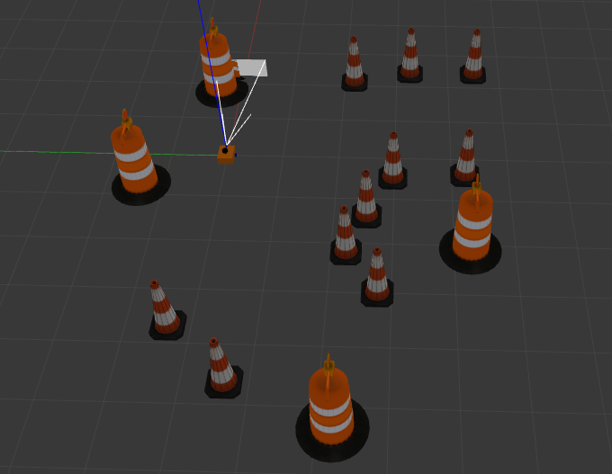
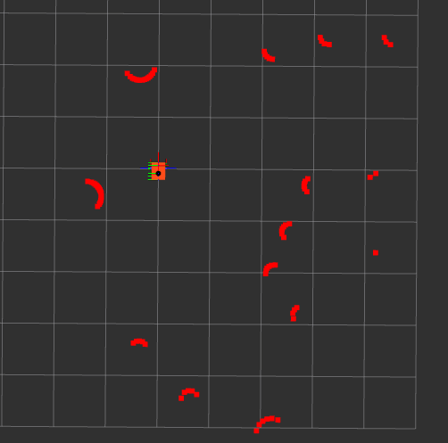
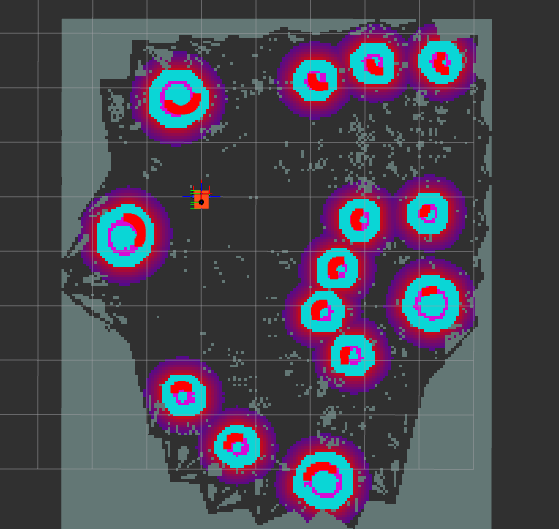

# LiDAR Guided Rover for Landmine Detection

A ROS 2-based autonomous rover project for LiDAR-guided mapping, localization, obstacle avoidance, and simulated landmine detection. The system combines Gazebo simulation, RViz visualization, Nav2-based navigation, and hardware-oriented motor control through an Arduino bridge for future physical deployment.

## Project Overview

This project was developed as a Final Year Project to demonstrate how a small autonomous rover can be used for minefield exploration and detection support. The rover uses a 2D LiDAR for mapping and navigation, ROS 2 for the software stack, Gazebo for simulation, and an Arduino-based motor-control bridge for physical rover integration.

The landmine detection layer was modeled as an abstract/proximity-based detection system rather than electromagnetic physics. This allowed the project to focus on the robotics workflow: mapping, localization, navigation, obstacle avoidance, minefield traversal, and detection visualization.

## Key Features

- ROS 2-based mobile robot architecture
- Gazebo simulation environment for rover testing
- URDF/Xacro robot description with LiDAR, camera, and differential-drive structure
- SLAM Toolbox configuration for mapping
- Nav2 configuration for autonomous navigation and obstacle avoidance
- RViz configurations for visualization of robot state, map, costmaps, and navigation behavior
- Arduino motor-controller bridge for physical rover integration
- Documentation, screenshots, final report, and poster included

## Technology Stack

- ROS 2
- Gazebo
- RViz
- Nav2
- SLAM Toolbox
- URDF / Xacro
- Arduino
- Raspberry Pi-oriented deployment
- LiDAR-based navigation
- Differential drive control

## Repository Structure

```text
lidar-guided-rover-landmine-detection/
│
├── ros2_ws/
│   └── src/
│       └── articubot_one/
│           ├── config/
│           ├── description/
│           ├── launch/
│           ├── worlds/
│           ├── CMakeLists.txt
│           └── package.xml
│
├── hardware/
│   └── ros_arduino_bridge/
│       └── ROSArduinoBridge/
│
├── docs/
│   ├── screenshots/
│   ├── report/
│   │
├── .gitignore
└── README.md
```

## Main Components

### 1. ROS 2 Rover Package

The `articubot_one` package contains the robot description, launch files, Gazebo worlds, navigation parameters, SLAM parameters, and RViz configurations.

### 2. Simulation

Gazebo worlds are used to test rover motion, obstacle interaction, mapping behavior, and navigation workflows before physical deployment.

### 3. Navigation

The project uses LiDAR-based mapping and Nav2-style navigation configuration for autonomous movement and obstacle avoidance.

### 4. Hardware Bridge

The Arduino bridge provides low-level motor control and encoder feedback for physical rover integration using a serial connection between the high-level computer and the motor controller.


- Designed and integrated the ROS 2-based rover simulation workflow.
- Configured robot description, LiDAR integration, Gazebo simulation, RViz visualization, SLAM, and Nav2 navigation files.
- Integrated an Arduino-based motor-control bridge for physical rover control.
- Prepared simulation and hardware workflows for Raspberry Pi-based rover deployment.
- Documented the system through report material, screenshots, simulation outputs, and project poster.

## Example Screenshots

### Gazebo World



### RViz Visualization



### Costmap




## Setup Notes

This repository is intended as a project portfolio and reference implementation. The exact setup may require adapting paths and package names depending on your ROS 2 distribution and Gazebo version.

### Build ROS 2 Workspace

```bash
cd ros2_ws
colcon build
source install/setup.bash
```

### Launch Simulation

```bash
ros2 launch articubot_one launch_sim.launch.py
```

### Launch SLAM

```bash
ros2 launch articubot_one online_async_launch.py
```

### Launch Navigation

```bash
ros2 launch articubot_one navigation_launch.py
```

## Documentation

The final report and poster are included in:

```text
docs/report/
```


## Future Improvements

- Add a cleaner custom mine-detection ROS 2 package
- Add real metal-detector sensor interface
- Add detection markers in RViz
- Add autonomous coverage planning for minefield scanning
- Improve physical rover calibration and motor PID tuning
- Add camera-based object detection for visual inspection
- Add full launch instructions for specific ROS 2 and Gazebo versions
